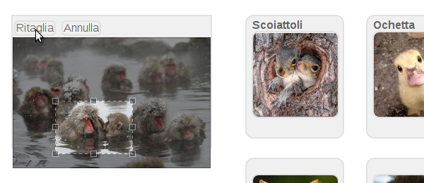
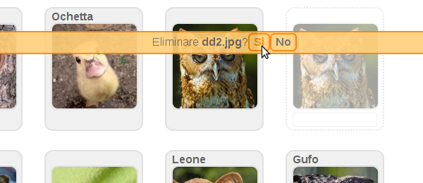
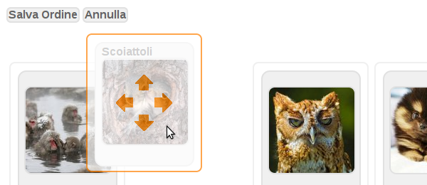
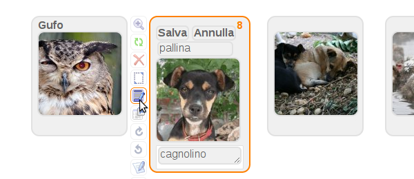
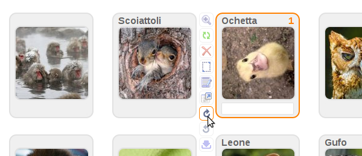
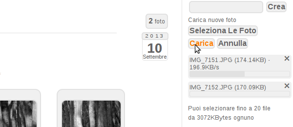
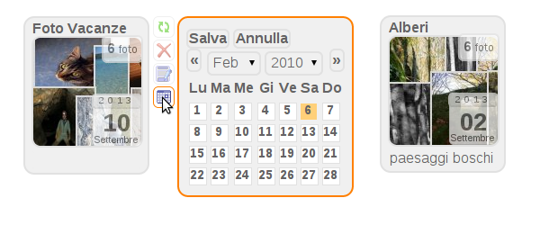

# UltraLightGallery
Lightweight database-less Gallery written in PHP/Javascript 

## Features 

* Modular architecture 38 plugins
* Integrated management interface
* SEO optimizations
* Javascript compression and automatic Css
* Dozens of plugins that can be activated
* No installation required
* Does not use external databases

# INSTALL

```bash
$ cd /var/www/mysite.com
$ wget https://github.com/stefanocudini/UltraLightGallery/archive/master.zip
$ unzip master.zip
$ mv UltraLightGallery-master gallery
$ chgrp -R www-data gallery
$ chmod -R 0775 gallery
```

Navigate with browser to: *http://mysite.com/gallery/*

















